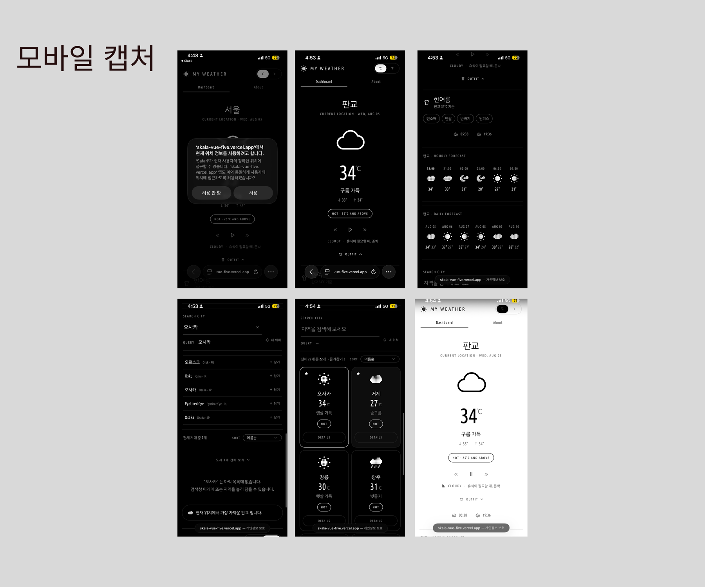
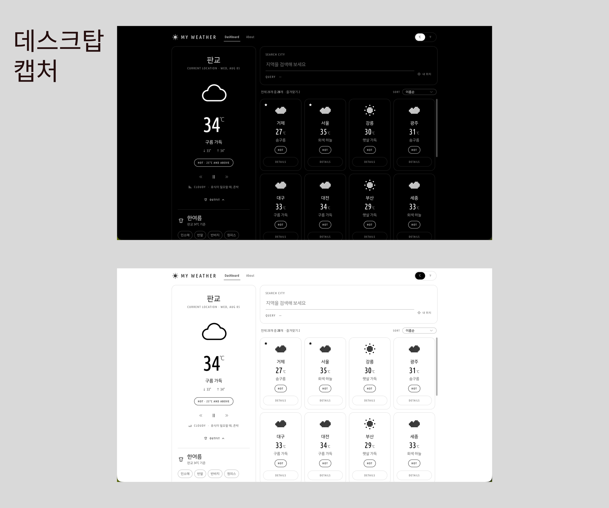

# 🌤️ My Weather

**주로 모바일 환경에서 사용하기 편하도록 제작한 웹**입니다. 
모바일과 데스크톱 환경에 각각 최적화된 UI를 적용했습니다.
기온과 날씨 정보는 기본으로 제공하면서도, 날씨를 확인할 때 자연스럽게 드는 ‘오늘 뭐 입지?’, ’오늘은 뭐 들으면서 나가지?’라는 고민을 함께 해결하고 싶었습니다. 그래서 날씨에 맞는 옷차림과 음악 추천을 담아, 하루를 준비하는 경험을 만들었습니다.

그래서 세 가지를 앞에 뒀습니다.

- 📍 **GPS 로 지금 있는 곳부터** — 도시를 고르기 전에 현재 위치에서 가장 가까운 곳을 띄웁니다
- 👕 **기온에 맞는 옷차림** — 기상청 생활기상지수의 체감온도 구간을 그대로 옮겼습니다
- 🎵 **날씨에 맞는 플레이리스트** — 날씨를 맑음, 흐림, 비 등 6가지로 나눠 갈래마다 다른 플레이리스트를 걸어뒀습니다.


SKALA Full-Stack Engineering — Frontend framework (Vue.js) 과정의 실습 과제입니다.

> 📄 설계 판단은 [`docs/DECISIONS.md`](docs/DECISIONS.md),
> 무엇을 만들려 했는지는 [`docs/PRODUCT.md`](docs/PRODUCT.md) 에 있습니다.

<br>

## I. 개발자 (Developer) 👥

| 박유진(FE) |
|:---:|
|  |
| [@dolmaroyujinpark](https://github.com/dolmaroyujinpark) |

<br>

---

# 📮 제출 (Submission)

<br>

## II. 제출 정보

| 항목 | 링크 |
|:---|:---|
| 저장소 | https://github.com/dolmaroyujinpark/skala-vue |
| 배포 | https://skala-vue-five.vercel.app |

### 최종 체크리스트

| 항목 | | 어디에 있나 |
|:---|:---:|:---|
| 반응형 상태 · `computed` · `watch` / `watchEffect` 로 검색 · 필터링 | ✅ | `WeatherHomeView.vue` — 검색어 `ref`, 필터·정렬 `computed` 11개, `watch` 3개, `watchEffect` 1개 |
| 컴포넌트 분리 + props / emit | ✅ | `WeatherParent`(2일차 원본) → `WeatherHomeView` 로 대체 · `BaseDashboardCard` · `SearchBar` · `WeatherCard` (+ `WeatherHero` · `ForecastStrip` · `OutfitCard` · `WeatherRadio` · `UnitToggler` · `RadioEngine`) |
| Vue Router 로 목록 ↔ 상세 이동 | ✅ | `router/index.js` — `/` ↔ `/weather/:cityId`, 지연 로딩 · Catch-all |
| Pinia 로 전역 상태 분리 | ✅ | `configStore` · `cityStore` · `favoriteStore` · `radioStore` (Setup Store 방식) |
| Axios 로 실제 API 연동 (로딩 · 에러 포함) | ✅ | `api/weather.js` · `api/ipLocation.js` — 로딩은 `isLoading` 으로 상태바, 실패는 `hasError` 로 `OFFLINE` 표시 |
| UI 라이브러리 (Element Plus) | ✅ | 정렬 `el-select` · `el-option`, 설명 `el-tooltip` |
| Vite 빌드 후 정상 배포 | ✅ | Vercel. `vercel.json` 의 SPA rewrite 로 새로고침 404 방지 |

> **`WeatherParent` 에 대하여** — 2일차 과제의 `WeatherParent.vue` 는 **3일차에 `views/WeatherHomeView.vue` 로 대체**했습니다.
> Vue Router 를 붙이면서 이 파일이 하던 두 가지 일이 갈라졌기 때문입니다 —
> 앱 껍데기(스플래시 · 테마 · 앱 바 · 단위 토글)는 `App.vue` 로, 대시보드 화면(히어로 · 예보 · 검색 · 카드)은 `WeatherHomeView.vue` 로.
> 무엇이 무엇으로 대체되었는지 나란히 볼 수 있도록 **2일차 원본을 지우지 않고 남겨 두었습니다.**
> 어디에서도 import 하지 않으므로 실행에도, 빌드 산출물에도 관여하지 않습니다.

### 제출 전 점검

| 점검 | 결과 |
|:---|:---|
| `npm run lint` | oxlint · eslint 모두 **에러 0 · 경고 0** (32개 파일) |
| ESLint Custom Rules | `eslint.config.js` 의 `app/custom-rules` — `no-unused-vars: warn`, `no-console: off`, `vue/multi-word-component-names: off` |
| API 키 | 소스에 하드코딩 없음(`import.meta.env.VITE_OWM_API_KEY`). 실제 키는 `.env.local`, `.gitignore` 의 `*.local` 로 제외 |
| 빌드 · 캐시 산출물 | `dist` · `.eslintcache` 모두 `.gitignore` 처리. git 에 추적되는 캐시 파일 0개 |
| 정적 호스팅 | `dist/` 정적 파일만 올라가므로 Node.js 런타임 없이 동작 |

> **base 경로**: Vercel 은 루트 도메인에 올라가므로 `vite.config.js` 에 `base` 를 두지 않았습니다(기본값 `/`).
> GitHub Pages 처럼 하위 경로(`/저장소명/`)에 올릴 때만 `base` 가 필요하고, 안 맞으면 흰 화면이 납니다.
> 대신 SPA 는 `/weather/city_01` 에서 새로고침하면 서버가 그 파일을 못 찾아 404 가 나는데, 그건 `vercel.json` 의 rewrite 로 막았습니다.

<br><br>

## III. 실행 방법 (Getting Started) ⚙️

```bash
npm install
cp .env.example .env.local     # OpenWeatherMap 키를 채웁니다
npm run dev
```

API 키는 `.env.local` 에 두고 커밋하지 않습니다 (`.gitignore` 의 `*.local`).

```bash
VITE_OWM_API_KEY=발급받은_키
```

키가 없어도 앱은 뜹니다 — `data/cities.js` 의 저장된 값으로 화면을 채우고, 상태바가 실시간이 아님을 알려 줍니다.

| 명령 | 하는 일 |
|:---|:---|
| `npm run dev` | 개발 서버 |
| `npm run build` | `dist/` 로 정적 빌드 |
| `npm run preview` | 빌드 결과 미리보기 |
| `npm run lint` | oxlint + eslint |
| `npm run format` | Prettier |

> `build` 스크립트에 `NODE_ENV=production` 을 직접 박아 두었습니다.
> Vite 는 프로덕션 여부를 `process.env.NODE_ENV || mode` 로 판정해 **NODE_ENV 가 mode 를 이깁니다.**
> 쉘에 `NODE_ENV=development` 가 있으면 `vite build` 인데도 개발용 코드가 산출물에 실리는 일이 실제로 있었습니다.

<br><br>

## IV. 구현한 기능 목록 📋

### 과제 요구사항

| 요구사항 | 구현 |
|:---|:---|
| 배열 렌더링 (`v-for` · `:key` 는 id) | `WeatherHomeView` → `WeatherCard` |
| 조건부 렌더링 (`v-if` / `v-else`, 25℃ 기준) | `WeatherCard` · `WeatherHero` 의 HOT / COOL 배지 |
| 컴포넌트 분리 (Props · Emits · Slot) | `components/mine/weather/` — 상태는 부모가 쥐고, 자식은 신호만 올립니다 |
| `computed` · `watch` · `watchEffect` | `WeatherHomeView` 의 검색 · 정렬 · 콘솔 로그 |
| Vue Router (지연 로딩 · 동적 경로 · Catch-all) | `router/index.js` |
| Pinia (state · getters · actions) | `stores/` — 아래 X 참고 |
| Axios 연동 · 로딩 / 실패 표시 | `api/weather.js` · 대시보드 상태바 · 상세의 `OFFLINE` 안내 |
| Element Plus | 정렬 `el-select`, 설명 말풍선 `el-tooltip` |

### 직접 붙인 기능

요구사항에는 없지만, "내가 쓰고 싶은 앱" 이 되려면 필요하다고 생각해 붙인 것들입니다.
전부 과제에서 배운 문법(Props · Emits · computed · store)만으로 만들었습니다.

| 기능 | 설명 |
|:---|:---|
| 📍 **현재 위치 자동 측위** | 앱을 켜면 GPS 로 지금 있는 곳에서 가장 가까운 도시부터 띄웁니다. 기기가 위치를 못 주면 접속 위치로 대략 짐작합니다 |
| 👕 **옷차림 추천** | 기상청 생활기상지수의 체감온도 구간을 그대로 옮겨, 기온에서 오늘 입을 것을 골라 줍니다 |
| 🎵 **날씨 라디오** | 하늘을 여섯 갈래로 나눠 갈래마다 플레이리스트를 걸었습니다. 화면을 옮겨도 음악이 끊기지 않습니다 |
| 🔎 **지역 검색 (한글 · 영문)** | 목록에 없는 지역을 찾아 담습니다. 한글로 안 찾히는 곳은 **보정표를 중계로** 두어 영문 이름으로 우회합니다 (`속초` → `Sokcho`) |
| ⭐ **즐겨찾기 · 정렬** | 별을 누른 순서가 곧 목록 순서입니다. 새로고침해도 남습니다 |
| 🌗 **스플래시 · 테마** | 첫 방문에만 소개 문구가 한 글자씩 찍힙니다. 다크 / 라이트는 OS 설정을 따라갑니다 |
| 📱 **모바일 레이아웃** | 좁은 화면에서는 카드를 6장만 보여 주고 접습니다 |

<br><br>

## V. 화면 (Screenshots) 📸

### 모바일



왼쪽 위부터 — 위치 권한 요청 · 현재 위치(판교)로 시작한 대시보드 · 시간별 / 일별 예보,
아래 — 지역 검색(`오사카`) · 담은 뒤의 카드 목록 · 라이트 테마.

### 데스크탑



같은 화면의 다크 / 라이트 테마입니다. OS 설정을 따라갑니다.

<br><br>

## VI. 4일간 어려웠던 점과 해결 과정 🧗

### 1. 맥에서는 안 되고 폰에서는 되는 GPS

가장 오래 붙잡은 문제입니다. 같은 코드인데 **폰에서는 위치가 잡히고 맥에서는 안 잡혔습니다.**
브라우저 권한을 허용으로 바꿔도 그대로였고, 맥 시스템 설정에서 Chrome 위치 권한도 **이미 켜져 있었습니다.**

원인을 찾은 건 Chrome 이 스스로 남기는 로그였습니다.

```
CoreLocationProvider: CoreLocation framework reported a kCLErrorLocationUnknown failure.
```

`kCLErrorLocationUnknown` 은 **"권한 거부"(`kCLErrorDenied`)가 아니라 "지금 위치를 알아낼 수 없음"** 입니다.
권한 문제가 아니라는 뜻이었습니다. 맥이 위치를 알아내는 방식을 따라가 보니 이랬습니다.

```
1. 주변 WiFi AP 들의 BSSID(공유기 MAC 주소) 를 스캔
2. 그 목록을 애플 측위 서버로 전송
3. 애플 DB 에서 "이 공유기들이 있는 곳" 을 조회
4. 좌표를 받아서 돌려줌
```

**맥에는 GPS 칩이 없어서 3번이 위성 대신입니다.** 사내망 · VPN 이 2~3번 통신을 막으면 권한과 무관하게 좌표를 만들 수 없습니다.
반면 폰에는 GNSS 칩이 있어 위성 신호를 직접 받으니 네트워크와 상관없이 잘 됩니다. `enableHighAccuracy: true` 가 그 칩을 씁니다.

**해결** — 앱이 고칠 수 없는 환경 문제라, 브라우저가 끝내 못 주면 **IP 로 대략 위치를 구하는 경로**(`api/ipLocation.js`)를 하나 더 뒀습니다.
IP 는 재는 게 아니라 "이 주소 대역은 보통 어디" 를 조회하는 것이라 정확하지 않습니다. 그래서 오차를 20km 로 **정직하게 신고**하고, 화면에도 "현재 위치" 가 아니라 **"접속 위치로 짐작한 ○○"** 라고 적습니다.

> ⚠️ 권한을 **거부**한 경우(`code === 1`)에는 IP 로 넘어가지 않습니다.
> "위치를 알려 주지 않겠다" 고 답한 사람을 뒷문으로 찾아내는 셈이 되기 때문입니다.
> 기계가 못 한 경우(`code === 2, 3`)만 폴백합니다.

### 2. 한글 지명으로는 못 찾는 지역

지역 검색을 붙였더니 `제주` · `판교` 는 찾는데 **`속초` 는 못 찾았습니다.** OpenWeatherMap 의 한글 색인이 도시마다 들쭉날쭉했습니다.
(`Sokcho` 로는 찾히고, 응답의 `local_names.ko` 에는 `속초시` 가 들어 있습니다.)

**해결** — 검색을 세 번 시도하게 하고, 마지막에 **보정표를 중계로 두었습니다.**

```
1) "속초,KR"    나라를 못 박아 브라질의 동명 도시를 걸러냄
2) "속초"       나라를 풀어 해외 지명도 찾게 ('파리' · '방콕')
3) "Sokcho,KR"  한글로 못 찾는 국내 지명을 보정표로 우회
```

3번이 `data/placeAliases.js` 입니다. 전국 지명을 직접 돌려 보고 "한글로 안 찾히는 것" 만 모아 만든 표입니다.
그래도 없으면 화면이 *"영문 이름으로도 찾아보세요 (예: Sokcho)"* 라고 다음 행동을 알려 줍니다.

### 3. API 가 주는 날씨 설명이 마음에 안 들어서

OWM 이 주는 `description` 은 `broken clouds` · `moderate rain` 처럼 번역기를 돌린 듯한 말입니다.
"오늘 뭐 입지" 를 묻는 앱에 어울리지 않아서 **직접 매핑했습니다** (`data/weatherLabels.js` 의 `toFriendlyStatus`).
어려운 작업은 아니었지만 화면 톤이 확 살아나서 가장 뿌듯했던 부분입니다. 🙂

### 4. 좋은 코드라고 생각했는데 기능을 죽이고 있던 것

좌표에는 "언제 잰 것인지"(`timestamp`)가 같이 옵니다.
낡은 좌표를 쓰면 안 될 것 같아서 **"10분보다 낡으면 버린다"** 는 규칙을 넣어 뒀습니다.

그런데 다른 사람 컴퓨터에서 이 로그가 찍혔습니다.

```
⚠️ [geo] 286분 전 좌표라 쓰지 않습니다.
```

**측위는 성공한 것입니다.** 브라우저가 좌표를 줬는데 우리가 버렸고, 그 사람 화면에서는 그냥 "위치 기능이 안 되는 앱" 이었습니다.

원인은 데스크톱의 `timestamp` 가 **"언제 측정했나" 가 아니라 "OS 가 마지막으로 위치를 알던 게 언제인가"** 에 가깝다는 것이었습니다.
그 컴퓨터도 새로 재는 데는 실패했고, CoreLocation 이 몇 시간 전 값을 대신 내준 것이었습니다.
(`maximumAge: 0` 은 Chrome 의 캐시를 막을 뿐 OS 캐시는 못 막습니다.)

**해결** — 처음에는 "이동했나?" 를 묻는 탭 복귀에서만 나이를 보게 고쳤습니다.
그런데 그러면 **같은 좌표를 앱 켤 때는 믿고 탭 복귀 때는 안 믿는** 셈이 됩니다. 틀린 좌표라면 두 경우 다 똑같이 틀리는데 한쪽만 거를 근거가 없었습니다.
그래서 규칙을 하나로 합쳤습니다 — **오차만 봅니다.**

좋아 보이는 방어 코드가 실제로는 기능을 죽이고 있었고, 내 컴퓨터에서만 돌려 봐서는 끝까지 몰랐을 문제였습니다. 4일 중 가장 크게 배운 부분입니다.

<br><br>

## VII. 제출 전 셀프 코드리뷰 🔍

**컴포넌트가 한 가지 역할만 하고 있나?**
대체로 지켰습니다 — `WeatherCard` 는 그리고 누른 신호만 올리고, 상태는 부모가 쥡니다. 다만 `WeatherHomeView` 가 검색 · 정렬 · 위치 · 즐겨찾기를 다 들고 있어 지금은 큽니다. 위치 관련은 composable(`useGeolocation`)로 떼어낼 여지가 분명히 있습니다.

**굳이 반응형으로 안 만들어도 될 걸 반응형으로 만들지 않았나?**
바뀌지 않는 표(`outfitTable` · `weatherLabels` · `weatherPlaylists` · `placeAliases`)는 전부 `data/` 의 평범한 모듈 상수로 두었습니다. `hasLocatedOnce` 도 화면에 안 그려지는 값이라 `ref` 가 아닌 일반 변수입니다 — 반응형으로 만들면 불필요한 재계산이 붙습니다.

**API 요청 중 · 실패 상황을 사용자가 알 수 있게 처리했나?**
로딩은 `isLoading` 으로 상태바 문구를 바꾸고, 실패는 `hasError` 로 `OFFLINE` 을 계속 띄웁니다. 문자열 대신 상태로 들고 있는 이유는, 문구로만 알리면 다음 클릭 한 번에 덮여서 지금 보는 숫자가 실시간인지 알 수 없어지기 때문입니다. 위치 실패는 원인별로 안내를 나눴습니다 — 권한 거부는 설정을 열어야 풀리므로 "다시 시도" 를 권하지 않습니다.

**변수 · 함수 이름만 보고 무엇을 하는지 알 수 있나?**
`isUsablePosition` 을 `isAccurateEnough` 로 바꾼 것이 이번 과제에서 이름 때문에 실제로 문제가 됐던 사례입니다. "쓸 만한가" 라는 뭉뚱그린 이름 안에 오차 검사와 나이 검사가 같이 들어 있었고, 그래서 나이 검사가 기능을 죽이고 있다는 걸 오래 못 봤습니다. 이름을 좁히자 검사 하나가 필요 없다는 게 바로 드러났습니다.

<br>

---

# 🗂️ 설계 기록 (Design Notes)

<br>

## VIII. 화면 (Pages) 🗺️

| 경로 | 화면 | 하는 일 |
|:---|:---|:---|
| `/` | 대시보드 | 선택한 도시의 큰 기온 · 옷차림 · 라디오 · 예보, 도시 카드, 검색 · 지역 담기 · 정렬 · 즐겨찾기 |
| `/weather/:cityId` | 도시 상세 | 습도 · 풍속 · 기압 · 일출/일몰과 시간별 · 일별 예보 |
| `/about` | 소개 | 무엇이 과제이고 무엇이 덤인지, 어떤 값을 왜 store 에 두었는지 |
| 그 외 | 404 | 정의되지 않은 주소를 전부 받는 Catch-all |

<br><br>

## IX. 기술 스택 (Tech Stack) 🧰

`Vue 3 (Composition API · script setup)` · `Vue Router` · `Pinia` · `Axios` · `Element Plus` · `Vite`

날씨는 [OpenWeatherMap](https://openweathermap.org/api) 에서 받아 옵니다.
현재 날씨는 `/weather`, 예보는 3시간 간격 5일치를 주는 `/forecast` 를 받아 시간별 · 일별 두 벌로 가공합니다.

도시는 이름 대신 **좌표로** 조회합니다 — 영문 표기가 제각각이라(거제는 응답에 `Kŏje` 로 옵니다) 이름으로는 못 찾는 곳이 있었습니다.

쓰는 API 는 여섯입니다. 브라우저에 내장된 것과 바깥 서버로 나가는 것이 섞여 있습니다.

| API | 종류 | 하는 일 |
|:---|:---|:---|
| OWM `/weather` · `/forecast` | 외부 서버 | 현재 날씨 · 시간별 / 일별 예보 |
| OWM `/geo/1.0/direct` | 외부 서버 | 지역 이름 → 좌표 (검색으로 담기) |
| OWM `/geo/1.0/reverse` | 외부 서버 | 좌표 → 지명 (GPS 로 담기) |
| `ipwho.is` | 외부 서버 | 브라우저 측위가 실패했을 때 IP 로 대략 위치 |
| YouTube IFrame Player | 외부 서버 | 날씨별 플레이리스트 재생 |
| 브라우저 Geolocation | 브라우저 내장 | 현재 위치 |

<br><br>

## X. 상태 관리 판단 (State) 🗃️

store 로 올릴지는 두 가지만 물어보고 정했습니다.
**화면보다 오래 살아야 하는가**, **트리로 이어지지 않는 두 곳 이상이 쓰는가**.
둘 다 아니면 그냥 `ref` 로 남겼습니다 — 전역으로 올리는 순간 "이 값이 어디서 바뀌었나" 를 찾을 범위가 앱 전체로 넓어지기 때문입니다.

| 값 | 자리 | 이유 |
|:---|:---|:---|
| ℃ / ℉ 단위 | `configStore` | 앱 바 · 히어로 · 카드 · 상세가 씁니다. 앱 바와 카드는 조상-후손이 아니라 props 로 안 이어집니다 |
| 즐겨찾기 목록 | `favoriteStore` | 새로고침해도 남아야 해서 localStorage 와 짝입니다. 저장 watch 가 화면에 있으면 그 화면이 떠 있을 때만 저장됩니다 |
| 담은 도시 목록 | `cityStore` | 목록 화면이 카드를 그리고, 상세 화면이 "그런 도시가 있는가" 를 판단합니다. 둘은 형제 화면입니다 |
| 음악 재생 상태 | `radioStore` | 소리를 내는 `RadioEngine`(앱 셸)과 누르는 `WeatherRadio`(히어로 안)는 형제라 props 로 이을 방법이 없습니다 |
| 다크 / 라이트 | `App.vue` 의 `ref` | 읽는 곳이 `:class` 한 줄뿐입니다. 자식들은 CSS 변수를 상속으로 받아 테마를 알 필요조차 없습니다 |
| 검색어 · 정렬 · 선택 도시 | `WeatherHomeView` 의 `ref` | 화면을 떠나면 사라지는 것이 맞습니다 |

한때 대표 도시를 지정하는 `pinStore` 가 하나 더 있었습니다.
즐겨찾기 순서가 같은 일을 더 잘하게 되자 — 최근에 담은 도시가 맨 앞이고 그게 곧 대표입니다 — 존재 이유가 사라져 걷어냈습니다.
기준은 만들 때만 쓰는 것이 아니라 지울 때도 씁니다.

<br><br>

## XI. 폴더 구조 (Structure) 📁

```
src/
├── api/
│   ├── weather.js          OpenWeatherMap — 날씨 · 예보 · 지오코딩
│   └── ipLocation.js       브라우저 측위가 실패했을 때 IP 로 대략 위치
├── data/                   API 가 모르는 것 — 도시 명부 · 상태 문구 · 옷차림 표 · 플레이리스트 · 지명 보정표
├── stores/                 configStore · cityStore · favoriteStore · radioStore
├── router/index.js         지연 로딩 · 동적 경로 · Catch-all
├── views/                  주소마다 갈아끼워지는 화면 넷
├── components/mine/        이 앱을 이루는 부품 (weather · icons)
└── assets/                 테마 토큰 · 공용 유틸 · Element Plus 톤 맞추기

docs/
├── DECISIONS.md            설계 판단 — 왜 이렇게 되어 있나
└── PRODUCT.md              정체성 · UX 원칙 · 과제와의 차별점
```
